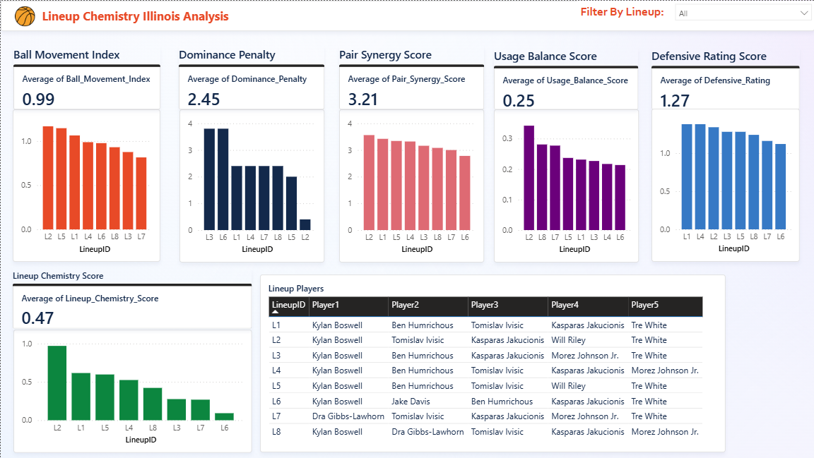

# 🏀 Lineup Chemistry Analyzer — Illinois Men’s Basketball

This project evaluates lineup chemistry by analyzing playstyle synergy across different 5-man combinations using advanced basketball stats.

## 🔍 Goal
Go beyond raw output and measure how well players *fit* together — using ball movement, usage distribution, and on/off impact.

## ⚙️ Tech Stack
- Python (pandas, numpy, matplotlib)
- Powerbi Dashboard (dashboard app)
- Public stats: Sports Reference

## 📁 Folder Structure
- `data/` — Raw CSVs for player stats + lineups
- `output/` — Final lineup scores
- `powerbi/` — Powerbi dashboard
- `notebooks/` — Prototyping/EDA

## ✨ Key Metrics & Methodology

The **Lineup Chemistry Score** is a comprehensive metric designed to quantify the synergy and collective effectiveness of 5-player lineups. It is calculated as a weighted sum of several normalized components, each reflecting a crucial aspect of team play:

* **Ball Movement Index (BMI):** Measures offensive fluidity and unselfishness. (Higher is better)
* **Usage Balance Score:** Assesses the distribution of offensive involvement. (Balanced usage, higher is better)
* **Dominance Penalty:** Identifies potential over-reliance on a single player. (Lower is better, indicating less penalty)
* **Pair Synergy Score:** Gauges the collective efficiency and collaborative effectiveness of the group. (Higher is better)
* **Overall Defensive Rating (DR):** Quantifies the lineup's collective defensive impact, derived from Defensive Win Shares. (Higher is better)

Each of these underlying metrics is normalized to a consistent scale (0 to 1) before being combined.

## 🔍 Explore Dashboard
* Navigate to the `powerbi/` folder.
* Open the `Lineup_Chemistry_Analyzer.pbix` file.
* **Note:** Power BI Desktop is required to open this file and fully interact with the dashboard.
* **Interactive Feature:** The dashboard allows you to dynamically adjust the weights for each chemistry component using sliders, providing real-time updates to the Lineup Chemistry Score.

## 📊 Dashboard Visuals

This section provides a visual overview of the interactive Power BI dashboard.

### Dashboard Main View

### Dynamic Weight Adjustment

### Lineup Results & Insights

